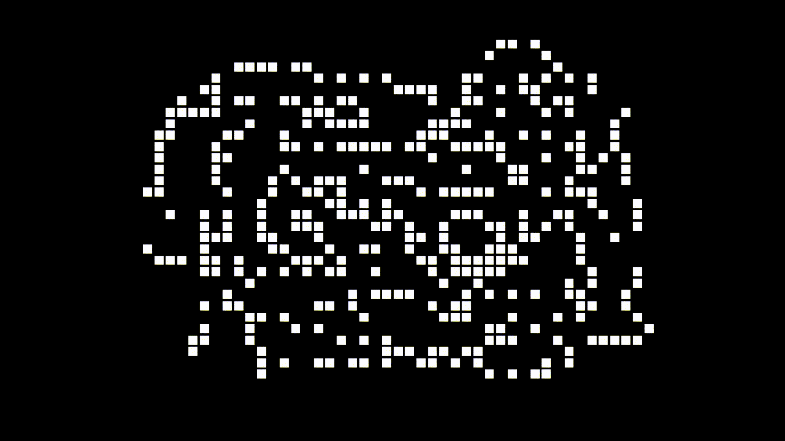

# Conway's Game of Life
This is an OpenGL implementation of Conway's Game of Life. I've tested this with 500x500 grids so it should be reasonably fast. The main game of life loop is done in a separate thread. According to perf, the most time is spent on counting a cell's neighbors(50%+).

# Examples




# Download
You can download pre-built binaries for [windows](https://github.com/AlexandruIca/GameOfLife/releases/tag/master) and [linux](https://github.com/AlexandruIca/GameOfLife/releases/tag/master).

# How to use
At first you can left click to set cells to be alive/dead and you can zoom in/out. You can also move in the scene with the arrow keys and `w` and `s`, but if you move the mouse clicks won't be interpreted correctly. You can press space to get to the next scene, in other words starting the actual game. There you can freely move in the scene.

Additionally there are some things you can modify with flags, for example:
```sh
./GameOfLife --width=500 --height=500 --color-dead=yellow --color-alive=red
```

# How to build
Install conan & CMake, and then:
```sh
mkdir build && cd build
conan install ..
cmake -DCMAKE_BUILD_TYPE=Release ..
cmake --build .
```

To build for development:
```sh
cmake \
    -DENABLE_SANITIZER_ADDRESS=ON \
    -DENABLE_SANITIZER_UNDEFINED=ON \
    -DBUILD_TESTS=ON \
    ..
```

And to run the tests:
```sh
ctest -V
```
